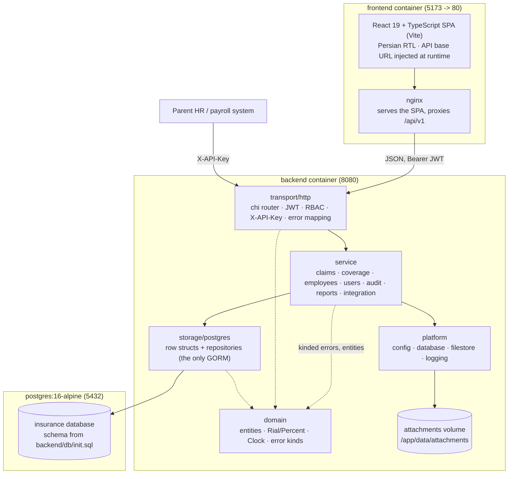

# Architecture — Supplementary Insurance Module

**Project**: Design and Implementation of a Supplementary Insurance Module
(طراحی و پیاده‌سازی ماژول بیمه تکمیلی) — bachelor's capstone project,
Bu-Ali Sina University.

This document describes the system as implemented in this repository: a
Go REST API backend (`backend/`), a React + TypeScript + Vite frontend
(`frontend/`), and a PostgreSQL database whose schema is owned by
`backend/db/init.sql`. It is grounded entirely in the code and configuration
present in the repository; see `docs/API-CONTRACT.md` for the complete
endpoint list, `docs/ERD.md` for the data model, and `docs/adr/` for the
decisions that shaped the structure below.

## 1. Design goal

The proposal's central requirement is that supplementary-insurance benefit
rules (coverage percentage, per-claim cap, annual cap, waiting period,
eligible relations) must be **config-driven, not hard-coded**: changing a
benefit is a data change (`INSERT INTO coverage_rules ...` via
`POST /coverage-rules`), never a Go code change or redeploy. Everything else
in the architecture — the layering, the pricing engine, the claim state
machine — is built to keep that property true. The
`internal/service/coverage` package doc comment states this directly:
*"Changing a benefit means publishing a new rule version through this
service — never a code change."*

## 2. Backend layering

The backend (`backend/`, Go module `insurance-module`) is a layered
application: **transport → service → storage**, with `domain` at the centre
and `platform` off to the side. The dependency rule is one-directional and is
what makes the rest of the design hold together — `domain` imports nothing of
ours, and no layer below `transport/http` knows that HTTP exists (ADR-0001).

```
cmd/api              entrypoint: load config, open DB, apply schema, wire, serve
cmd/createadmin      idempotent bootstrap of the sole admin account

internal/domain      entities, enums, money, Clock, error kinds — no imports of ours
internal/service/    the business logic, one package per capability:
    coverage           config-driven pricing + rule/reference-data administration
    claims             claim lifecycle state machine + attachments
    employees          employee/dependent records and their coverage view
    users              authentication, account management, role rules
    audit              the generic before/after trail
    reports            read-only aggregations
    integration        parent HR/payroll endpoints (API-key authenticated)
internal/storage/postgres
                     the only place GORM appears: row structs + repositories
internal/transport/http
                     chi router, DTOs, middleware (JWT/RBAC/key), error mapping
internal/platform/   infrastructure with no business meaning:
    config, database, filestore, logging
internal/app         the composition root that wires all of the above together
```

### 2.1 domain — the centre

`internal/domain` holds the entities (`Claim`, `Employee`, `CoverageRule`,
`Attachment`, …), the enums, and three things that would otherwise leak
inconsistently across the codebase:

- **Money** (`money.go`). `Rial` is an `int64` of whole rials and `Percent` is
  a percentage in basis points (70.00% = 7000). Money never travels through
  the system as a float, and there is exactly one rounding decision — half-up
  to the whole rial, inside `Percent.ApplyTo` — so caps are always compared
  against an already-whole amount and no fractional value can escape into a
  payment or an annual-cap total (ADR-0003).
- **Time** (`clock.go`). Services take a `domain.Clock` rather than calling
  `time.Now()`, so waiting periods and contract-year windows are deterministic
  under test. `BusinessDay` normalises an instant to a civil day in
  `Asia/Tehran`, so a receipt dated the first eligible day qualifies no matter
  what timezone the server runs in (ADR-0004).
- **Errors** (`errors.go`). A `domain.Error` carries a `Kind`
  (`NotFound`, `Forbidden`, `Conflict`, `Validation`, `Unprocessable`, …).
  Services return kinded errors; the transport layer maps kind → HTTP status
  in one place. No handler picks a status code ad hoc, and no service imports
  `net/http` to say "this is a 409".

Entities carry **no** struct tags. Serialization belongs to the transport
DTOs and column mapping belongs to the storage row types, so neither the wire
format nor the schema can drift into the business model by accident.

### 2.2 service — the business logic

Each service package declares the storage interface *it* needs (a `Repo`
interface listing just those methods) and receives an implementation by
injection. The interfaces are defined by the consumer, not the provider, so a
service can be read and tested without the storage package in view.

Writes that must not half-happen take a transaction function
(`atomic func(ctx, func(Repo) error) error`) so the service expresses *"these
changes commit together"* without knowing what a `*gorm.DB` is.

**coverage** is the centrepiece. `Calculate` answers *how much is payable
right now*, in order: load the employee and reject if not `active`; resolve
the beneficiary relation (verifying a dependent really belongs to the
claiming employee); find the rule version active on the receipt date; check
the relation is eligible; check the waiting period has elapsed in Tehran
civil days; sum what this employee has already committed this contract year
for the same service type and plan; then delegate to `Compute`. `Compute` is
a **pure function** — rule, requested amount, annual amount already used in,
payable amount and which cap bound it out — so the pricing arithmetic is
exhaustively table-tested with no database at all.

The **contract year** for annual-cap resets is anchored to the rule's own
`effective_from` anniversary, not the calendar year, matching the Iranian
contract period in the seed data. Rules are **versioned**: `publish.go` closes
the outgoing version and opens the new one, clamping a same-day republish and
breaking ties on `created_at`, so "what was the policy on this date?" always
has exactly one answer — which is what lets an approved claim be defensible
months later.

**claims** owns the lifecycle. The legal transition table is:

```
draft              -> submitted
submitted          -> under_review
under_review       -> approved | rejected | returned_for_docs
returned_for_docs  -> submitted
approved           -> paid
rejected           -> closed
paid               -> closed
```

Anything else is `ErrInvalidTransition` (HTTP 409). Every transition
(`Submit`, `Resubmit`, `StartReview`, `Approve`, `Reject`, `ReturnForDocs`,
`MarkPaid`, `Close`) runs through a shared `apply()` helper which, in one
transaction: loads the claim, checks the transition is legal, runs the
action-specific closure (the permission check and field updates), persists the
claim, and writes the audit row. `Reject` and `ReturnForDocs` require a
non-empty reason before the transition is attempted. `MarkPaid` creates a
`payments` row with a simulated `SIM-<8-hex>` reference — a real payment
gateway is deliberately out of scope.

**Attachments** (`claims/attachments.go`) hang off the same service because
the rule that governs them is a claim rule, not a file rule: documents may
only be added while the claim is a `draft` or has been
`returned_for_docs` (`domain.Claim.AcceptsAttachments`). Freezing them at
submission is what makes review meaningful — the evidence a reviewer decided
on cannot change under them afterwards. Uploads are validated by **sniffing
the content**, not by trusting the declared type or the extension, and capped
at 5 MiB. The blob is written first, then the row and the audit entry commit
together; if that transaction fails the blob is removed, so there are no
orphans in either direction.

### 2.3 storage/postgres — the only place GORM appears

`postgres.Store` implements every repository interface the service layer
declares. It holds row structs (with GORM tags) that are *separate* from the
domain entities, plus mappers between them. This is what keeps ORM concerns
out of the business logic: a GORM tag, a `NUMERIC` column, or a join lives
here and nowhere else.

`Store.Atomic` runs a function inside one transaction, handing it a `*Store`
bound to that transaction — the methods are identical either way, so a
service's code path is the same whether or not it is inside a transaction.

The schema itself is **not** owned by the ORM: `AutoMigrate` is never called.
`backend/db/init.sql` is the single reviewable definition of tables,
constraints, checks and indexes, applied on startup when the schema is
missing; `backend/db/seed.sql` supplies reference and demo data.

### 2.4 transport/http

`router.go` builds the chi router: request ID, structured request logging,
panic recovery, a 30-second timeout, CORS, then the route groups. Each group
carries its own middleware stack — `authenticate` verifies the bearer JWT,
`requireRole(...)` gates the group to an allow-list, and `requireAPIKey`
gates the integration routes on a SHA-256 hash of `X-API-Key` matching an
active row in `integration_api_keys`.

Handlers are thin by design: decode a DTO, call one service method, encode the
result. `respond.go` maps `domain.Kind` to the HTTP status, so the status
codes documented in `docs/API-CONTRACT.md` are produced in one place rather
than chosen per handler.

Two things keep the API honest against `backend/api/openapi.yaml`
(ADR-0002):

- `Routes()` enumerates every `METHOD /path` the router serves, and
  `TestOpenAPISpecCoversEveryRoute` fails if the spec and the router disagree
  in either direction — the document cannot silently fall behind the code.
- `TestOpenAPIConformance` boots the real router against a real database and
  validates actual request/response bodies against the spec, so the contract
  is checked as behaviour, not as prose.

The same document generates the frontend's TypeScript types and is served at
`/openapi.yaml` with Swagger UI at `/swagger`.

### 2.5 platform — infrastructure with no business meaning

- **config** reads `APP_ENV`, `HTTP_PORT`, `DATABASE_URL`, `JWT_SECRET`,
  `JWT_TTL`, `DB_INIT_PATH`, `ATTACHMENTS_DIR` and `CORS_ORIGIN`, each with a
  development-safe default. In production it *refuses to start* on the
  default or a too-short JWT secret, or without an explicit `DATABASE_URL` —
  the kind of misconfiguration that is otherwise discovered by being
  exploited.
- **database** opens the pool and applies `db/init.sql` when the schema is
  absent.
- **filestore** is the attachment blob store. Files are written under a single
  root with **server-generated UUID names** — the user's filename is metadata,
  never a path — and every read resolves the key and rejects anything absolute
  or escaping the root, so a crafted key cannot reach outside the store.
- **logging** provides the structured `slog` logger and the request-logging
  middleware.

### 2.6 app — the composition root

`app.Build` is the single place the object graph is assembled: store →
services (each with its transaction adapter, the clock, and its
dependencies) → `transport/http.Services`. `cmd/api` and the integration
tests both call it, so tests exercise the same wiring that production uses
rather than a hand-assembled approximation.

## 3. RBAC model

Authorisation is enforced at two levels, and the split is deliberate:

- **Role, at the route.** `requireRole(...)` on a chi route group answers
  *"may this kind of user call this endpoint at all?"* It is declared once per
  group in `router.go`, where the whole surface can be read at a glance.
- **Ownership, in the service.** Whether *this* user may touch *this* record
  depends on the record, so it lives with the business logic — an employee may
  submit only claims they created, sees only their own claims in a list, and
  has `employee_id` forced to their own record on create. Putting these in the
  service means they hold no matter which entrypoint calls it.

| Role | Can do |
|---|---|
| **admin** | Everything: manage employees and dependents, publish coverage rules and reference data (service types, contracts, plans), manage user accounts, drive any claim through the workflow, read audit logs and reports, and act as the owner of any claim. |
| **reviewer** | Drive a claim from `submitted` through `under_review` to a decision: `start-review`, `approve` (which prices it), `reject` (reason required), `return-for-docs` (reason required), `mark-paid`, `close`. Can list and view employees, view any claim and its documents, and read reference data. Cannot create or edit employees, publish coverage rules, or manage users. |
| **employee** | Create a claim for themselves, submit/resubmit their own claims, upload documents while a claim is a draft or has been returned for documents, and view their own claims, employee record, dependents and remaining caps. Cannot perform any review action. |
| **auditor** | Read-only oversight: any claim and its full history, the audit log, and the reports. Cannot perform any transition or change any configuration. |

All four roles can read the shared reference endpoints (`GET /service-types`,
`/contracts`, `/plans`, `/coverage-rules`, `/auth/me`).

Two rules about the admin account are enforced in the users service rather
than the router, because they are invariants rather than route permissions:
an admin cannot be created, demoted or deactivated through the user-management
API, and an account with the `employee` role must be linked to an employee
record.

The parent-system integration endpoints
(`POST /integration/employees/sync`, `GET /integration/claims/{id}/status`)
sit outside the role model entirely — they are gated by `X-API-Key` only,
since they represent a trusted system-to-system caller rather than an
interactive user.

## 4. How pricing and workflow compose

The two are composed by injection, not inheritance: the claims service holds
a coverage service and calls `Calculate` from inside `Approve`. This keeps
`coverage` completely independent — it knows nothing about claim statuses or
transitions, it only computes an amount — while making `claims` the single
place that decides *when* pricing happens and what to do with the result.

Pricing happens **exactly once, at approval**, and the amount, the applied
percentage and the rule version are written in the same transaction as the
status change and the audit entry. Because the transition table has no
`approved -> approved` edge, a claim cannot be silently repriced; and because
the price is taken from whichever rule version was in force on the claim's
*receipt date*, a later policy change never retroactively alters a decided
claim. If the rule engine refuses (no active rule, ineligible relation,
waiting period, inactive employee), `Approve` fails atomically: the claim
stays `under_review`, nothing is persisted, and the transport layer reports
422 with the reason.

## 5. Frontend

The frontend (`frontend/`) is a React 19 + TypeScript + Vite single-page app
that consumes the REST API described by `backend/api/openapi.yaml`. It is
fully Persian and right-to-left: Jalali dates, Persian digits, the bundled
Vazirmatn font, and a light/dark/system theme switch.

**API base URL.** The client reads `window.__APP_CONFIG__.apiBaseUrl`, served
by `/config.js` (populated in the container from the `API_BASE_URL`
environment variable), and falls back to the same-origin path `/api/v1`. That
means the base URL is a *runtime* value, so one built image can be deployed
against different backends — in development, Vite proxies `/api/v1` to
`API_PROXY_TARGET` (`frontend/vite.config.ts`); in Docker, nginx proxies it.
The JWT from `POST /auth/login` is attached as `Authorization: Bearer <token>`
by an axios request interceptor, and a response interceptor logs the user out
on `401`.

**Types are generated, not hand-written.** `frontend/src/api/schema.d.ts` is
produced from the OpenAPI document by `npm run gen:api`; `src/api/types.ts`
only re-exports friendly aliases from it (ADR-0002). CI fails if the committed
output is stale.

**Structure.**

- `src/app/routes.ts` — the single table of which role may open which screen;
  both the router guards and the sidebar are generated from it, so role
  changes cannot be applied to one and forgotten in the other.
- `src/app/router.tsx` — routes with per-page `React.lazy`, so the charting
  library ships only to users who open the reports screen.
- `src/pages/` — the screens: login, claims list/new/detail, my coverage,
  employees, coverage rules, service types, contracts, plans, users, reports,
  audit log.
- `src/components/` — shared UI (`DataTable`, `Card`, `StatusBadge`,
  `JsonViewer`, form fields, pagination).
- `src/lib/format.ts` — Jalali/Persian formatting plus the enum→Persian label
  maps; `src/lib/errorMessages.ts` translates the API's English error messages
  at the presentation boundary (the API stays English because the parent
  system consumes it too).

**Claim documents.** `src/pages/claims/ClaimAttachments.tsx` renders the
«مدارک» section on the claim detail page: the document list with per-item
download, and an upload control shown only when the API would accept one
(owner or admin, claim in `draft` or `returned_for_docs`). Downloads go
through the axios client rather than a plain link, because the endpoint needs
the bearer token; the blob is then handed to the browser as a save.

## 6. Deployment topology

`docker-compose.yml` (repository root) defines three services:

- **postgres** (`postgres:16-alpine`) — the database, with a named volume
  (`pgdata`) for persistence and a `pg_isready` healthcheck that the
  backend service waits on (`depends_on: condition: service_healthy`).
- **backend** — built from `backend/Dockerfile`; runs the compiled `cmd/api`
  binary, which applies the schema on startup before serving. Configured
  entirely via environment variables: `DATABASE_URL` (points at the
  `postgres` service on the compose network), `JWT_SECRET`, `JWT_TTL`,
  `DB_INIT_PATH` (`/app/db/init.sql` inside the image), `ATTACHMENTS_DIR`
  (`/app/data/attachments`) and `CORS_ORIGIN`. Exposed on host port `8080`.
  Claim documents are files, not database rows, so the attachments directory
  is backed by its own named volume (`attachments`) — without it, uploads
  would be lost whenever the container is replaced.
- **frontend** — built from `frontend/Dockerfile`. The API base URL is a
  *runtime* value (`API_BASE_URL`, default `/api/v1`), written into
  `/config.js` at container start, so the same image works against any
  backend. Depends on `backend` starting first (not health-gated). Served on
  host port `5173` (container port `80`: nginx serving the built SPA and
  proxying `/api/v1` to the backend).

There is no separate gateway container: nginx inside the frontend image
proxies `/api/v1` to the backend, so the browser talks to a single origin.
The backend still configures CORS (`go-chi/cors` in `router.go`) for the
development setup, where Vite serves the SPA on its own port.



## 7. Testing strategy

The suite is layered the same way the code is, so a failure points at a layer
rather than at "something broke".

**Pure unit tests — no database.**

- `domain/money_test.go` pins the money rules: `PercentFromFloat` rounds
  rather than truncates (33.33 × 100 is 3332.999… in float64, which would
  truncate to 3332 and quietly underpay every claim), half-up rounding in
  `ApplyTo`, and no overflow at the schema's ceiling.
- `service/coverage/compute_test.go` table-tests the pure `Compute` against
  all five seeded service types: per-claim cap, annual cap, both at once, an
  exhausted annual cap, and an uncapped rule.
- `service/coverage/timezone_test.go` asserts the contract-year window is
  identical whatever the host timezone, that it anchors on the rule's
  anniversary, and that business days normalise to Tehran midnight.
- `platform/config/config_test.go` asserts production refuses the default
  secret, a short secret, and a missing `DATABASE_URL`.
- `platform/filestore/filestore_test.go` asserts hostile keys — `../secret`,
  absolute paths, empty — cannot escape the storage root.

**Integration tests — real Postgres, wired by `app.Build`.** They run against
`TEST_DATABASE_URL`; `make test-integration` provisions a throwaway cluster
for them, and each test rolls back so the seeded reference data is never
polluted. They cover the workflow happy path (submit → review → approve →
paid → close, asserting the computed amount and the payment row), the reject
and return-for-docs paths and their reason requirements, invalid transitions,
forbidden actors, an employee seeing only their own claims, every refusal
path in the rule engine (inactive employee, waiting period, ineligible
relation, dependent mismatch, no rule before the contract starts), same-day
rule republishing and tiebreaks, the admin-account invariants, and the full
attachment story — upload/list/download with its audit row, the freeze across
the returned-for-docs loop, rejection of a disguised file type, and the
access-control boundaries.

**Contract tests.** `TestOpenAPISpecCoversEveryRoute` and
`TestOpenAPIConformance` (see §2.4) hold the router, the OpenAPI document and
the generated frontend types to each other.

**Golden test.** `service/coverage/golden_pricing_test.go` freezes an
exhaustive table of pricing boundaries — fractional percentages, .5 rounding,
cap collisions, exhausted caps — against expected rial amounts captured from
the pre-integer-money implementation. Regenerating it takes a deliberate
`UPDATE_GOLDEN=1`, so a change in pricing behaviour shows up as a reviewable
diff instead of silently re-pricing claims.
