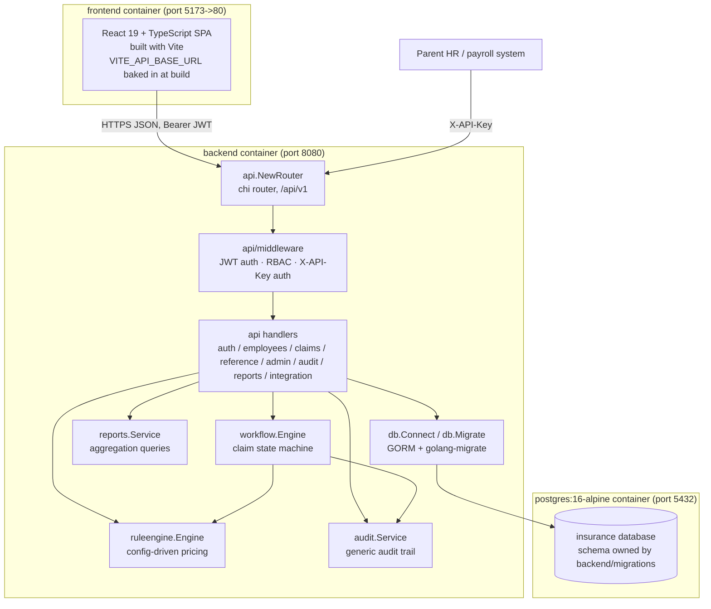

# Architecture — Supplementary Insurance Module

**Project**: Design and Implementation of a Supplementary Insurance Module
(Persian: *Tarahi va Piadesazi-e Mazhul-e Bime-ye Takmili*) — bachelor's
capstone project, Bu-Ali Sina University.

This document describes the system as implemented in this repository: a
Go REST API backend (`backend/`), a React + TypeScript + Vite frontend
(`frontend/`), and a PostgreSQL database whose schema is owned by
`backend/migrations/`. It is grounded entirely in the code and configuration
present in the repository at the time of writing; see `docs/API-CONTRACT.md`
for the complete endpoint list and `docs/ERD.md` for the data model.

## 1. Design goal

The proposal's central requirement is that supplementary-insurance benefit
rules (coverage percentage, per-claim cap, annual cap, waiting period,
eligible relations) must be **config-driven, not hard-coded**: changing a
benefit is a data change (`INSERT INTO coverage_rules ...` via
`POST /coverage-rules`), never a Go code change or redeploy. Everything else
in the architecture — the layering, the rule engine, the workflow engine —
is built to keep that property true. The `backend/internal/ruleengine`
package doc comment states this directly: "this package never encodes a
service type, percentage, or cap in Go code."

## 2. Backend layering

The backend (`backend/`, Go module `insurance-module`) is organised as a
small set of single-purpose packages, wired together in
`backend/cmd/api/main.go`. Each layer only depends on the ones below it;
nothing below `internal/api` knows about HTTP.

```
cmd/api/main.go            entrypoint: load config, migrate, connect, wire, serve
cmd/seed/main.go           idempotent demo-data seeder (one user per role, sample claims)

internal/config            env-var configuration (DATABASE_URL, JWT_SECRET, CORS_ORIGIN, ...)
internal/db                Postgres connection (GORM) + schema migration (golang-migrate)
internal/models            GORM entity structs; JSON tags double as the REST wire format
internal/ruleengine         config-driven coverage calculation (pure Compute() + DB-backed Calculate())
internal/workflow           claim lifecycle state machine, composes ruleengine + audit
internal/audit               generic before/after audit trail, used by workflow and by config-change writes
internal/auth                 bcrypt password hashing + JWT issuance/verification
internal/api/middleware      JWT auth, RBAC (RequireRole), API-key auth (RequireAPIKey)
internal/api                  chi router (router.go) + REST handlers (*_handlers.go)
internal/reports              read-only aggregation queries for the reporting screens
```

### 2.1 config

`internal/config.Load()` reads `APP_ENV`, `HTTP_PORT`, `DATABASE_URL`,
`JWT_SECRET`, `JWT_TTL`, `MIGRATIONS_PATH`, `CORS_ORIGIN` from the
environment (via `.env` in development, through `godotenv`), each with a
development-safe fallback. This is the only place environment-dependent
values are read.

### 2.2 db — GORM for queries, golang-migrate for schema

`internal/db.Connect` opens a `*gorm.DB` against Postgres.
`internal/db.Migrate` runs `golang-migrate` up-migrations from
`backend/migrations/*.sql` before the server starts serving traffic
(`cmd/api/main.go` calls `db.Migrate` before `db.Connect`).

This split is deliberate and is called out in the `internal/db` package
comment: *"migrations own schema evolution, GORM is only ever used to
query/write rows against that already-migrated schema."* Concretely:

- **GORM AutoMigrate is never called anywhere in the codebase.** The schema
  (tables, constraints, indexes, check constraints, defaults) lives
  entirely in `backend/migrations/000001_init.up.sql` and
  `000002_seed_reference_data.up.sql`.
- `internal/models` structs exist purely to describe how to read/write rows
  of an already-existing schema — each has an explicit `TableName()` method
  pinning it to the migration-created table, and the package comment says
  as much: *"GORM AutoMigrate is never used ... these structs only describe
  how to read/write it."*
- This means schema changes are reviewable, versioned SQL (a `.up.sql` /
  presumably paired `.down.sql` per migration) rather than being inferred
  from struct tags at runtime — important for a system whose entire pitch
  is "policy changes go through data, not code," which extends naturally to
  "schema changes go through migrations, not ORM inference."

### 2.3 models

`internal/models/models.go` defines one Go struct per table plus the enum
types used as CHECK-constrained string columns (`Role`, `EmploymentStatus`,
`Relation`, `BeneficiaryType`, `ClaimStatus`, `PaymentStatus`). JSON tags on
every field are the literal REST API field names (see
`docs/API-CONTRACT.md`), so the model file is simultaneously the Go
persistence layer and the API schema reference. `internal/models/jsonmap.go`
adds a `JSONMap` type implementing `driver.Valuer`/`sql.Scanner` so the
`audit_logs.before_data/after_data/metadata` `jsonb` columns can hold
arbitrary structured snapshots.

### 2.4 ruleengine — the centrepiece

`internal/ruleengine.Engine` (backed by a `*gorm.DB`) answers one question:
*given an employee, a service type, a plan, a beneficiary, a requested
amount and a receipt date, how much is payable right now?* It never encodes
a percentage or cap in Go — every number comes from the `coverage_rules`
row returned by `activeRule()`, which selects the row for
`(plan_id, service_type_id)` whose `effective_from <= receiptDate` and whose
`effective_to` is either null or `>= receiptDate`, ordered by
`effective_from DESC`.

`Calculate()` (the DB-touching entry point) performs, in order:
1. Load the employee, reject if `employment_status != 'active'`
   (`ErrEmployeeInactive`).
2. Resolve the beneficiary relation — `self`, or the dependent's `relation`
   after verifying the dependent belongs to the claiming employee
   (`ErrDependentMismatch`).
3. Look up the active rule for `(plan_id, service_type_id)` on the receipt
   date (`ErrNoActiveRule` if none).
4. Check the relation is in the rule's `eligible_relations` array
   (`ErrNotEligible`).
5. Check the employee's `hire_date + waiting_period_days` has elapsed as of
   the receipt date (`ErrWaitingPeriod`).
6. Sum `payable_amount` already committed this contract-year for the same
   employee/service-type/plan across claims in `approved`,
   `payment_calculated`, `paid`, or `closed` status (`usedAnnualAmount`),
   optionally excluding the claim being recalculated.
7. Delegate to `Compute()` — a pure function (no DB access) that applies
   `coverage_percent`, then the per-claim cap, then the remaining annual
   cap, floors at zero, and rounds to 2 decimals. Because `Compute` takes
   no DB handle, it is exhaustively table-tested in
   `ruleengine_test.go` against all five seeded service types without a
   database.

`RemainingCaps()` reuses the same `activeRule`/`usedAnnualAmount` machinery
to build the "remaining caps per service type" dashboard consumed by
`GET /employees/{id}/remaining-caps`.

The **contract year** used for annual-cap resets is anchored to the rule's
own `effective_from` anniversary (`contractYearWindow`), not the calendar
year — so a rule effective 2025-03-21 resets its annual cap every
21 March, matching the actual Iranian-calendar-aligned contract period
seeded in `000002_seed_reference_data.up.sql` (2025-03-21 to 2026-03-20).

### 2.5 workflow — the claim lifecycle state machine

`internal/workflow.Engine` owns the claim status transitions. The legal
transition table (`transitions` map in `workflow.go`) is:

```
draft              -> submitted
submitted          -> under_review
under_review       -> approved | rejected | returned_for_docs
returned_for_docs  -> submitted
approved           -> paid
rejected           -> closed
paid               -> closed
```

Any transition not in this table is rejected with `ErrInvalidTransition`
(HTTP 409, per `docs/API-CONTRACT.md`). Every transition method
(`Submit`, `Resubmit`, `StartReview`, `Approve`, `Reject`, `ReturnForDocs`,
`MarkPaid`, `Close`) runs through a shared `apply()` helper that, inside one
`gorm.DB` transaction:

1. Loads the claim and checks `canTransition(from, to)`.
2. Runs the action-specific `mutate` closure (role check + field updates).
3. Persists the updated claim.
4. Writes one `audit_logs` row (`entity_type="claim"`, `action=<name>`,
   before/after status, and the reason or `payable_amount` if present).

RBAC is enforced per-action inside the closures, not in a separate layer:
`Submit`/`Resubmit` require the actor to be the claim's creator or an admin;
`StartReview`/`Approve`/`Reject`/`ReturnForDocs`/`MarkPaid`/`Close` require
`requireReviewer` (role `reviewer` or `admin`). `Reject` and `ReturnForDocs`
additionally require a non-empty `reason` (`ErrReasonRequired`, HTTP 400)
before the transition is even attempted.

**Composition with the rule engine**: `Approve` is the one transition that
calls into `ruleengine.Calculate` (see `workflow.go`, `Approve` method). It
prices the claim using the claim's own `employee_id`/`service_type_id`/
`plan_id`/`beneficiary_type`/`dependent_id`/`requested_amount`/
`receipt_date`, excluding the claim's own id from the annual-cap sum (since
the claim isn't yet counted as committed spend), and stores
`coverage_percent_applied` and `payable_amount` on the claim in the same
transaction as the status change and the audit write. If the rule engine
returns any of its sentinel errors (no active rule, not eligible, waiting
period, employee inactive), `Approve` fails atomically — the claim is left
`under_review`, nothing is persisted, and the API layer maps the error to
HTTP 422 (`internal/api/handlers.go`, `mapDomainError`).

`MarkPaid` requires a non-nil `payable_amount` (i.e. the claim must already
be `approved`) and creates a `payments` row with a simulated
`SIM-<8-hex>` reference — a real payment gateway is explicitly out of scope
per the code comment on `MarkPaid`.

### 2.6 audit — the generic trail

`internal/audit.Service` writes and queries `audit_logs` rows. `Log()`
takes the caller's `*gorm.DB` handle (which may be an open transaction) so
an audit entry commits atomically with the change it describes — this is
how `workflow.apply()` and the coverage-rule config-change handler both
guarantee "the state change and its audit record either both happen or
neither does." `Query()` supports filtering by `entity_type`, `entity_id`,
`actor_user_id`, `action`, and a date range, with pagination; `Trail()` is a
convenience wrapper for "full history of one entity" used by
`GET /claims/{id}/history`.

### 2.7 auth

`internal/auth` wraps `bcrypt` for password hashing/verification and
`golang-jwt/jwt/v5` for HS256 JWT issuance/parsing. The JWT payload
(`auth.Claims`) carries `user_id`, `username`, and `role` — enough for the
API layer to build a `workflow.Actor` directly from the verified token
without an extra database round-trip per request
(`internal/api/handlers.go`, `currentActor`).

### 2.8 api/middleware and api — routing and RBAC

`internal/api/middleware.Authenticate` verifies the `Authorization: Bearer
<JWT>` header and stores the parsed claims on the request context.
`RequireRole(roles...)` gates a route group to a role allow-list.
`RequireAPIKey` gates the parent-system integration routes on a SHA-256
hash of the `X-API-Key` header matching an active row in
`integration_api_keys` — a deliberately separate, JWT-independent auth
scheme for system-to-system calls.

`internal/api/router.go` wires everything using `go-chi/chi` route groups,
each carrying its own middleware stack, and delegates to handlers in
`auth_handlers.go`, `employee_handlers.go`, `claims_handlers.go`,
`reference_handlers.go`, `admin_handlers.go`, `audit_handlers.go`,
`reports_handlers.go`, and `integration_handlers.go`. `handlers.go` holds
the shared plumbing: JSON encode/decode, pagination, date-range parsing,
and `mapDomainError`, which translates the sentinel errors from
`workflow`/`ruleengine` into the exact HTTP status codes documented in
`docs/API-CONTRACT.md` (409 invalid transition, 403 forbidden, 400 missing
reason, 422 unpriceable claim).

### 2.9 reports

`internal/reports.Service` runs read-only aggregation queries directly
against `claims` (joined to `employees`/`service_types` where needed):
a dashboard `Summary` (total claims, total paid, pending review, approved
awaiting payment, rejected), and three breakdowns — by employee, by
service type, by month — all restricted to claims whose status represents
committed spend (`approved`, `payment_calculated`, `paid`, `closed`).

## 3. RBAC model

Four roles are defined in `internal/models.Role` and enforced by
`RequireRole` on route groups in `internal/api/router.go`, with a handful
of additional ownership checks inside individual handlers
(`authorizeEmployeeAccess`, `authorizeClaimAccess` in `handlers.go`).

| Role | Can do |
|---|---|
| **admin** | Everything below, plus: create/patch employees, create dependents, create service types/contracts/plans/coverage rules (the policy-change endpoint), manage users (`/admin/users`), create claims on behalf of any employee. Effectively a superset of `reviewer` and can act as the owner of any claim for submit/resubmit. |
| **reviewer** | Drive a claim from `submitted` through `under_review` to a decision: `start-review`, `approve` (triggers rule-engine pricing), `reject` (reason required), `return-for-docs` (reason required), `mark-paid`, `close`. Can view any employee's detail/dependents/remaining-caps and any claim (via the ownership-check fallthrough for admin/reviewer in `authorizeEmployeeAccess`/`authorizeClaimAccess`), and read reference data (service types, contracts, plans, coverage-rule history). Cannot create/edit employees, cannot manage coverage rules, cannot manage users. |
| **employee** | Create a claim for themselves (`employee_id` is forced server-side to their own record — see `resolveClaimEmployeeID`), submit/resubmit only claims they created, view only their own claims, employee record, dependents, and remaining caps. Cannot start-review/approve/reject/etc. — blocked by `requireReviewer`. |
| **auditor** | Read-only: view any claim and its full audit history, view the audit-log endpoint (`/audit-logs`), and the `/reports/*` endpoints. Cannot view the employee list/detail/dependents (not in the admin/reviewer/self allow-list checked by `authorizeEmployeeAccess`), cannot perform any claim transition, cannot manage config. |

All four roles can read the reference/lookup endpoints open to any
authenticated user: `GET /service-types`, `GET /contracts`, `GET /plans`,
`GET /coverage-rules`, `GET /auth/me`.

**Implementation note**: `docs/API-CONTRACT.md` documents `GET /employees`
(the list endpoint) as `admin, reviewer`, but as wired in
`internal/api/router.go` today that route sits only in the admin-only
group — the router file itself carries a comment acknowledging this
("`adminOrReviewer` kept for symmetry/future routes"). Reviewers can still
reach an individual employee via `GET /employees/{id}` (which *is* open to
admin/reviewer through `authorizeEmployeeAccess`), just not the paginated
list/search. Anyone extending the router should route `GET /employees`
through `adminOrReviewer` to close this gap.

The parent-system integration endpoints
(`POST /integration/employees/sync`, `GET /integration/claims/{id}/status`)
bypass RBAC roles entirely — they sit behind `RequireAPIKey` only, since
they represent a trusted system-to-system caller, not an interactive user.

## 4. Rule engine × workflow composition

The two engines are composed by dependency injection, not inheritance:
`workflow.NewEngine(db, rulesEngine, auditSvc)` takes a `*ruleengine.Engine`
and calls `rules.Calculate(...)` from inside `Approve`'s mutate closure.
This keeps `ruleengine` fully independent (it has zero knowledge of claim
statuses or transitions — it only computes an amount) while letting
`workflow` be the single place that decides *when* pricing happens
(exactly once, at approval) and what to do with the result (store it on the
claim, atomically, alongside the status change and the audit entry).
Re-running `Approve` is not possible once a claim is `approved` (the
transition table has no `approved -> approved` entry), so a claim is priced
exactly once against whichever `coverage_rules` version was active on its
`receipt_date` at approval time.

## 5. Frontend

The frontend (`frontend/`) is a React 19 + TypeScript + Vite single-page
app (see `frontend/package.json`), intended to consume the REST API
described in `docs/API-CONTRACT.md` over `VITE_API_BASE_URL` (baked in at
build time via the Docker build arg in `deploy/docker-compose.yml`, default
`http://localhost:8080/api/v1`), attaching the JWT from `POST /auth/login`
as `Authorization: Bearer <token>` on subsequent calls. As of this
snapshot of the repository, `frontend/src/App.tsx` is still the unmodified
Vite+React starter template — the frontend application logic (login,
claim submission, reviewer queue, admin coverage-rule editor, reports
dashboard) has not yet been built out. This document describes the
intended integration surface, not implemented UI screens.

## 6. Deployment topology

`deploy/docker-compose.yml` defines three services:

- **postgres** (`postgres:16-alpine`) — the database, with a named volume
  (`pgdata`) for persistence and a `pg_isready` healthcheck that the
  backend service waits on (`depends_on: condition: service_healthy`).
- **backend** — built from `backend/Dockerfile`; runs the compiled
  `cmd/api` binary, which migrates the schema on startup
  (`db.Migrate`) before serving. Configured entirely via environment
  variables: `DATABASE_URL` (points at the `postgres` service on the
  compose network), `JWT_SECRET`, `JWT_TTL`, `MIGRATIONS_PATH`
  (`file:///app/migrations` inside the image), `CORS_ORIGIN`. Exposed on
  host port `8080`.
- **frontend** — built from `frontend/Dockerfile`, with
  `VITE_API_BASE_URL` baked in as a build arg (Vite env vars are
  compile-time, not runtime). Depends on `backend` starting first (not
  health-gated). Served on host port `5173` (container port `80`, i.e. a
  static file server / reverse proxy in front of the built SPA).

There is no separate reverse-proxy/gateway container — the frontend and
backend are reached on two different host ports directly, and CORS on the
backend (`go-chi/cors`, configured in `router.go`) is what allows the SPA
origin to call the API cross-origin.



## 7. Testing strategy (as implemented)

- `internal/ruleengine/ruleengine_test.go` table-tests the pure `Compute()`
  function against all five seeded service types (outpatient visit,
  pharmacy, dental, hospitalization, optometry), covering per-claim-cap
  capping, annual-cap capping, both at once, an exhausted annual cap, and
  an uncapped ("unlimited") rule — with no database dependency.
- `internal/workflow/workflow_test.go` runs the full engine
  (`workflow.Engine` + a real `ruleengine.Engine` + a real `audit.Service`)
  against an actual Postgres instance (`TEST_DATABASE_URL`, defaulting to
  the `deploy/docker-compose.yml` database), inside one outer transaction
  per test that is always rolled back so seeded reference data and other
  tests are never polluted. It covers the happy path
  (submit → start-review → approve → mark-paid → close, asserting the
  computed `payable_amount` and the created `Payment` row), the reject
  path (including the `ErrReasonRequired` guard), the
  return-for-docs/resubmit path, an invalid transition
  (`approve` on a `draft` claim), and a forbidden actor
  (an employee calling `start-review`).
