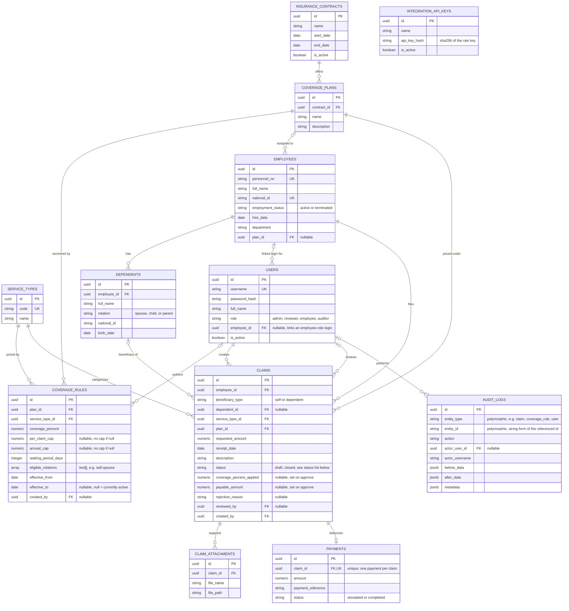

# Entity-Relationship Diagram — Supplementary Insurance Module

Derived directly from `backend/db/init.sql` (schema) and
`backend/db/seed.sql` (reference data).
Field lists below are abbreviated to primary/foreign keys and the fields
that matter for understanding the model; see the migration file for the
exact column list, types, defaults, and CHECK constraints.

## Diagram

Note: `AUDIT_LOGS.entity_type`/`entity_id` is a deliberately polymorphic
reference (a string type name plus a string id), not a database foreign
key — it lets one table log events against claims, coverage rules, users,
or any future entity uniformly, at the cost of referential-integrity
enforcement at the database level. `INTEGRATION_API_KEYS` has no
foreign-key relationships to any other table; it is consulted only by the
`RequireAPIKey` middleware, by comparing a SHA-256 hash.

## Table-by-table description

**`insurance_contracts`** — the top-level annual policy purchased from the
insurer (seed data: "Annual Supplementary Insurance Contract 1404",
2025-03-21 to 2026-03-20). `CHECK (end_date > start_date)`.

**`coverage_plans`** — a named benefit tier under a contract
(`ON DELETE CASCADE` from `insurance_contracts`). The seed data defines two:
"Standard" and "Premium," differing only in the `coverage_rules` rows
attached to them, not in any plan-level field — the plan itself carries no
benefit numbers.

**`service_types`** — the catalogue of claimable service categories
(seeded with `outpatient_visit`, `pharmacy`, `dental`, `hospitalization`,
`optometry`; admins can add more via `POST /service-types`). Each row has a
stable `code` and a display `name` (Persian in the seed/UI), e.g. `دندان‌پزشکی`
for dental.

**`coverage_rules`** — the config-driven policy engine's entire data
source, and the table this project is built around. One row is one
version of the benefit terms for a `(plan_id, service_type_id)` pair:
`coverage_percent`, `per_claim_cap` (nullable = uncapped per claim),
`annual_cap` (nullable = uncapped per year), `waiting_period_days`, and
`eligible_relations` (a `text[]` such as `{self,spouse,child}` — parents
are excluded from dental/optometry/hospitalization eligibility in the
seeded Standard/Premium rules for `dental` and `optometry`, for example).
See "Coverage-rule versioning" below.

**`employees`** — the insured population, synced from the parent
HR/payroll system (via `POST /integration/employees/sync`) or created
directly by an admin. `employment_status` is `active` or `terminated`
(CHECK-constrained); the rule engine refuses to price a claim for a
non-active employee (`ErrEmployeeInactive`). `plan_id` is nullable — an
employee with no plan assigned cannot have a claim created for them (the
`createClaim` handler rejects with 422, "employee has no coverage plan
assigned").

**`dependents`** — an employee's covered family members: `relation` is
`spouse`, `child`, or `parent` (CHECK-constrained), matching the values
used in `coverage_rules.eligible_relations`.

**`users`** — login accounts, one per interactive actor. `role` is one of
`admin`, `reviewer`, `employee`, `auditor` (CHECK-constrained,
`internal/domain.Role`). `employee_id` is nullable and links an
`employee`-role account to its `employees` row (only employee-role users
are expected to have one set — the users service refuses to create or
update an `employee`-role account without one, though the column itself
does not enforce that, nor a uniqueness constraint). `password_hash` is
bcrypt and never leaves the storage layer: the transport DTO for a user
simply has no field for it.

**`claims`** — the central transactional entity. Beyond the fields listed
above, it also carries `submitted_at`, `reviewed_at`, `paid_at`,
`closed_at` timestamps, each set by the corresponding workflow transition.
`status` is CHECK-constrained to nine values: `draft`, `submitted`,
`under_review`, `returned_for_docs`, `approved`, `rejected`,
`payment_calculated`, `paid`, `closed`. Of these,
**`payment_calculated` is defined in the schema and in
`internal/domain.ClaimStatus` but is never set by the claim service's
transition table** (`internal/service/claims/claims.go`) — the implemented
lifecycle goes `approved -> paid` directly, since `Approve` itself computes
`payable_amount`. `payment_calculated` is referenced only as one of the
"this counts as committed spend" statuses in the rule engine's annual-cap
sum and in the reports service, effectively reserved for a possible future
explicit pricing step that is not currently reachable through the API.

**`claim_attachments`** — supporting documents for a claim (`ON DELETE
CASCADE` from `claims`), written by `POST /claims/{id}/attachments`.
`file_name` is the original name as typed by the uploader and is only ever
displayed; `file_path` is a storage key relative to `ATTACHMENTS_DIR` whose
filename is a server-generated UUID, so a hostile name cannot become a path.
The rows are metadata only — the bytes live on disk (see
`internal/platform/filestore`), and the row and its audit entry commit
together after the blob is written.

**`payments`** — one simulated disbursement per claim, created by
`MarkPaid` (`internal/service/claims/transitions.go`). `claim_id` is `UNIQUE`, enforcing at most one
payment per claim. `payment_reference` is a generated `SIM-<8 hex chars>`
string; `status` is `simulated` or `completed` (only `simulated` is ever
written by the current code — a real payment gateway is explicitly out of
scope per the code comment on `MarkPaid`).

**`audit_logs`** — the generic audit trail served by
`internal/service/audit`: every mutating action (login, claim transitions,
document uploads, coverage-rule config changes) writes one row here with
`before_data`/`after_data`/`metadata` as `jsonb` snapshots, an actor
(`actor_user_id` + denormalized `actor_username`, so the actor's name
survives even if the user row is later changed or deactivated), and
`occurred_at`. Indexed on `(entity_type, entity_id)`, `occurred_at`, and
`actor_user_id` for the three access patterns used by
`GET /claims/{id}/history` and `GET /audit-logs`.

**`integration_api_keys`** — credentials for the parent-system
integration; `RequireAPIKey` middleware hashes the incoming `X-API-Key`
header with SHA-256 and checks it against an `is_active = true` row here.
No FK relationships to any other table.

## Coverage-rule versioning

`coverage_rules` is an append-mostly, versioned table:

1. **Insert-only in the common case.** Creating a new benefit version
   (`POST /coverage-rules`) always inserts a brand-new row — it never
   updates `coverage_percent`, `per_claim_cap`, `annual_cap`,
   `waiting_period_days`, or `eligible_relations` on an existing row.
2. **The one field that is ever mutated in place is `effective_to` on the
   row being superseded**, and only to close it off.
   `PublishRuleVersion` (`internal/service/coverage/publish.go`) looks up
   the currently-open row for the same `(plan_id, service_type_id)`
   (`effective_to IS NULL`) inside a transaction, sets its
   `effective_to = new_rule.effective_from - 1 day`, then inserts the new
   row with the requested `effective_from`. A same-day or backdated
   republish would make that close date precede the row's own start and
   violate the `effective_to >= effective_from` CHECK, so it is clamped to
   the old rule's start date; on that one overlapping day the engine picks
   the newer version via the `created_at` tiebreak. Both writes commit
   atomically with a single `audit_logs` entry
   (`entity_type="coverage_rule"`, `action="config_change"`,
   `before={"previous_rule": ...}`, `after={"new_rule": ...}`).
3. **"Active" is a date-range lookup, not a boolean flag.** `activeRule()`
   in `internal/service/coverage/coverage.go` selects the row where
   `effective_from <= onDate AND (effective_to IS NULL OR effective_to >=
   onDate)`, ordered by `effective_from DESC`, limit 1. This means a claim
   is always priced against whichever rule version was in force on its own
   `receipt_date` — including, correctly, a rule version that has since
   been superseded, as long as the claim's receipt date falls inside that
   version's `[effective_from, effective_to]` window. This is what makes
   "insert a new coverage_rules row and the next claim priced against it
   picks up the change automatically, with no code deploy" hold true even
   when claims for *past* receipt dates are approved *after* a new rule
   version exists.
4. **`GET /coverage-rules`** returns the full version history for a
   `(plan_id, service_type_id)` — every row ever inserted, newest
   `effective_from` first — which is exactly what a UI needs to show "this
   benefit's history," not just its current value.
5. The seed data (`000002_seed_reference_data.up.sql`) inserts the first
   version of every rule with `effective_from = '2025-03-21'` (the
   contract's start date) and `effective_to = NULL`, i.e. every seeded rule
   starts out as the single, currently-active version — there is no prior
   version to close off on day one.
