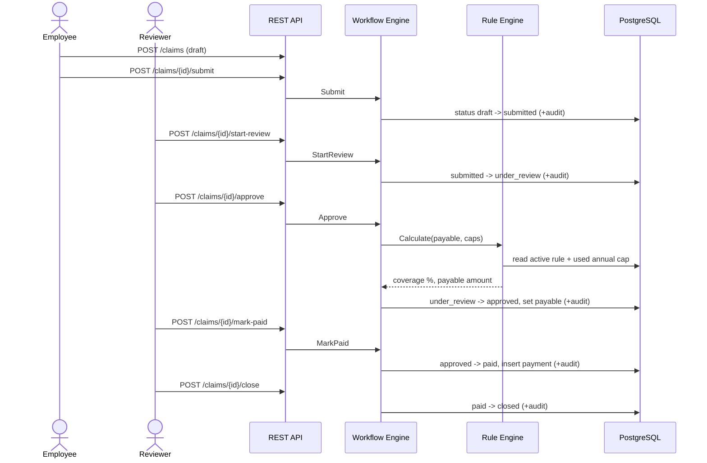

# Use Cases — Supplementary Insurance Module

Design and Implementation of a Supplementary Insurance Module
(Persian: Tarahi va Piadesazi-e Mazhul-e Bime-ye Takmili).

This document describes the primary use cases the module supports. Each references
the real REST endpoints in [API-CONTRACT.md](API-CONTRACT.md) and the behaviour
implemented in `backend/internal/{workflow,ruleengine,audit,api}`.

Actors:

- **Employee** — an insured member of staff. Submits claims for themselves or their
  dependents, tracks their own claims, and views their remaining coverage caps.
- **Reviewer** — processes submitted claims (approve / reject / return for documents),
  triggers payment.
- **Admin** — manages employees, dependents, users, and the config-driven coverage
  rules; can do everything a reviewer can, plus create claims on behalf of employees.
- **Auditor** — read-only oversight: the full audit trail and management reports.
- **Parent system** — an external HR/master-data system authenticating with an API key.

The four interactive roles are enforced by JWT + role middleware
(`backend/internal/transport/http/middleware.go`), with per-record ownership
checks in the services themselves; the parent system authenticates with a
separate `X-API-Key` scheme.

---

## UC-1 — Employee submits a claim (self or dependent)

**Actor:** Employee (or Admin on the employee's behalf)

**Preconditions:**
- The actor is authenticated (`POST /auth/login` returned a JWT).
- The employee has a coverage plan assigned (`employees.plan_id` is not null).
- For a dependent claim, the dependent exists and belongs to that employee.

**Main flow:**
1. The employee opens the New Claim form. The client loads service types via
   `GET /service-types` for the dropdown.
2. For a dependent claim, the client loads the employee's dependents via
   `GET /employees/{id}/dependents`.
3. The employee submits `POST /claims` with `beneficiary_type` (`self` or
   `dependent`), optional `dependent_id`, `service_type_id`, `requested_amount`,
   `receipt_date` (RFC3339), and `description`. The server forces `employee_id` to
   the caller's own for an employee-role user, fills `plan_id` from the employee
   record, and creates the claim in status `draft`.
4. The employee reviews the draft on the claim detail page and calls
   `POST /claims/{id}/submit`, moving it `draft -> submitted`. `submitted_at` is set.

**Alternate / error flows:**
- **No plan assigned:** the server returns `422` ("employee has no coverage plan
  assigned"); the claim is not created.
- **Employee-role caller supplies another employee_id:** ignored — the server always
  binds the claim to the caller's own `employee_id`.
- **Submitting a non-draft claim:** the workflow engine rejects the transition with
  `409 Conflict` (`ErrInvalidTransition`).

**Postconditions:**
- A claim row exists in status `submitted`, visible to reviewers/admins in the queue.
- An audit entry (`entity_type=claim`, `action=submit`) records the transition.

---

## UC-2 — Reviewer processes a claim

**Actor:** Reviewer (or Admin)

**Preconditions:** A claim exists in status `submitted`. The actor has role
`reviewer` or `admin`.

**Main flow (approve path):**
1. Reviewer opens the review queue (`GET /claims?status=submitted` /
   `?status=under_review`) and then the claim detail (`GET /claims/{id}`).
2. Reviewer calls `POST /claims/{id}/start-review` (`submitted -> under_review`).
3. Reviewer calls `POST /claims/{id}/approve`. The workflow engine invokes the rule
   engine (see UC-3 for how it prices), which computes `coverage_percent_applied`
   and `payable_amount` from the active coverage rule and the employee's remaining
   annual cap. The claim moves `under_review -> approved`, and `reviewed_by` /
   `reviewed_at` are set.
4. Reviewer calls `POST /claims/{id}/mark-paid` (`approved -> paid`). A simulated
   `payments` row is written (a real disbursement gateway is out of scope per the
   proposal), and `paid_at` is set.
5. Reviewer calls `POST /claims/{id}/close` (`paid -> closed`).

**Alternate flows:**
- **Reject:** from `under_review`, `POST /claims/{id}/reject` with a required
  `{"reason": ...}` body moves the claim to `rejected`; the reason is stored and
  audited. A missing reason returns `400` (`ErrReasonRequired`). From `rejected`,
  `POST /claims/{id}/close` ends the lifecycle.
- **Return for documents:** from `under_review`, `POST /claims/{id}/return-for-docs`
  with a required reason moves the claim to `returned_for_docs`. The employee then
  calls `POST /claims/{id}/resubmit` (`returned_for_docs -> submitted`) after
  attaching the missing documents, and the cycle repeats. Documents are
  uploaded with `POST /claims/{id}/attachments`, which the service accepts
  only while the claim is a `draft` or has been `returned_for_docs` — once it
  is back in the queue the evidence the reviewer decided on is frozen.

**Error flows:**
- **Wrong order (e.g. approve before start-review):** `409 Conflict`
  (`ErrInvalidTransition`) — the state machine only permits the transitions in
  `backend/internal/service/claims/claims.go`.
- **Employee attempts a reviewer action:** `403 Forbidden` (`ErrForbidden`), enforced
  both by route middleware and inside the claim service.
- **Pricing fails at approval:** `422` with the underlying rule-engine reason
  (see UC-3 error flows). The claim stays `under_review`.

**Postconditions:** The claim reaches a terminal state (`closed`), and every
transition — with actor, timestamp, before/after status, and any reason — is in the
audit trail, retrievable via `GET /claims/{id}/history`.

### Sequence — approve path

---

## UC-3 — Admin changes a coverage rule (config-driven, zero code deploy)

**Actor:** Admin

**Preconditions:** A plan and service type exist. The actor has role `admin`.

This is the centrepiece of the project: the "coverage rule engine" is data-driven.
No service type, percentage, or cap is hard-coded in Go — everything the engine needs
lives in the `coverage_rules` table, versioned by `effective_from` / `effective_to`.

**Main flow:**
1. Admin opens the Coverage Rules page (`GET /coverage-rules` shows the full version
   history, newest first).
2. Admin submits `POST /coverage-rules` with `plan_id`, `service_type_id`,
   `coverage_percent`, optional `per_claim_cap` and `annual_cap`,
   `waiting_period_days`, `eligible_relations`, and `effective_from`.
3. In a single transaction the server closes the previous active rule for the same
   `(plan_id, service_type_id)` by setting its `effective_to = effective_from - 1 day`,
   inserts the new version, and writes a `config_change` audit entry containing both
   the old and new rule.
4. The next claim priced against that plan/service type automatically uses the new
   rule — no code change, no redeploy. (Verified end-to-end during development: a
   dental rule was raised from 50% to 65% purely through this endpoint and the change
   was immediately reflected in a subsequent employee's remaining-caps view.)

**Alternate / error flows:**
- **Non-admin caller:** `403 Forbidden`.
- **No previous rule exists:** the insert still succeeds; nothing is closed off.
- **Invalid body (bad UUID, missing required field):** `400 Bad Request`.

**Postconditions:** A new `coverage_rules` row is active; the previous version is
retained (not deleted) with a closed `effective_to`, preserving full policy history;
a `config_change` audit entry exists.

---

## UC-4 — Auditor investigates history

**Actor:** Auditor (or Admin)

**Preconditions:** The actor has role `auditor` or `admin`.

**Main flow (per-claim history):**
1. Auditor opens a claim and calls `GET /claims/{id}/history`, receiving every
   audited event for that claim (submit, start-review, approve/reject/return,
   mark-paid, close) with actor, timestamp, and before/after status.

**Main flow (system-wide audit search):**
1. Auditor opens the Audit Log page and calls `GET /audit-logs` with any combination
   of filters: `entity_type` (`claim`, `coverage_rule`, `user`), `entity_id`,
   `actor_user_id`, `action`, and a `from`/`to` date range, paginated.
2. Each entry renders its `before_data` / `after_data` JSON for inspection.

**Alternate / error flows:**
- **Employee or reviewer attempts to read `/audit-logs`:** `403 Forbidden` (the route
  is restricted to admin + auditor).

**Postconditions:** None (read-only). Every material event — claim transitions,
config changes, and logins — is retrievable, satisfying the auditability requirement.

---

## UC-5 — Admin manages employees, dependents, and users

**Actor:** Admin

**Preconditions:** The actor has role `admin`.

**Main flow (employees & dependents):**
1. `GET /employees` (searchable, paginated) lists staff; `POST /employees` creates one
   with a plan assignment; `PATCH /employees/{id}` updates status/plan/department/name.
2. On the employee detail page, `GET /employees/{id}/dependents` lists dependents and
   `POST /employees/{id}/dependents` adds one (spouse/child/parent).
3. `GET /employees/{id}/remaining-caps` shows per-service-type coverage, caps, and
   used/remaining annual amounts for the employee's current plan.

**Main flow (users):**
1. `GET /admin/users` lists accounts; `POST /admin/users` creates one with a role and,
   for employee-role users, a linked `employee_id`.
2. `PATCH /admin/users/{id}` changes a user's role, activates/deactivates them, or
   resets their password.

**Alternate / error flows:**
- **Non-admin caller on any of the above mutating routes:** `403 Forbidden`.
- **Reviewer/self read access:** reviewers (and the employee themselves) may read an
  employee record and remaining caps, but only admins may create/modify.
- **Deactivated user login:** `POST /auth/login` returns `401` for an inactive account.

**Postconditions:** Employee/dependent/user records reflect the changes; a deactivated
user can no longer authenticate.

---

## UC-6 — Parent system syncs employee master data

**Actor:** Parent system (machine-to-machine)

**Preconditions:** A valid, active integration API key exists in
`integration_api_keys` (its SHA-256 hash is stored, never the raw key). The proposal
scopes real live integration out; this endpoint is the seam that a real HR system
would call.

**Main flow:**
1. The parent system calls `POST /integration/employees/sync` with header
   `X-API-Key` and a batch of employee records.
2. The server upserts each record by `personnel_no` (create if new, update otherwise)
   inside a transaction and returns `{ "created": n, "updated": m }`.
3. The parent system can poll a claim's outcome via
   `GET /integration/claims/{id}/status`, returning `{ id, status, payable_amount }`.

**Alternate / error flows:**
- **Missing or invalid API key:** `401 Unauthorized`; no JWT is involved on these
  routes.
- **Invalid `plan_id` in a record:** the whole batch transaction fails and rolls back.

**Postconditions:** The `employees` table reflects the synced master data; no partial
batch is ever committed.

---

## Cross-cutting: access control summary

| Capability                              | admin | reviewer | employee | auditor |
|-----------------------------------------|:-----:|:--------:|:--------:|:-------:|
| Create/submit own claim                 |  ✓    |          |   ✓      |         |
| Create claim for any employee           |  ✓    |          |          |         |
| Review (start/approve/reject/return)    |  ✓    |   ✓      |          |         |
| Mark paid / close                       |  ✓    |   ✓      |          |         |
| View own claims                         |  ✓*   |   ✓*     |   ✓      |   ✓*    |
| Manage employees/dependents             |  ✓    |  read    |  self    |         |
| Manage coverage rules (config)          |  ✓    |          |          |         |
| Manage users                            |  ✓    |          |          |         |
| Audit log & reports                     |  ✓    |          |          |   ✓     |
| Parent-system integration (API key)     |  — machine-to-machine, not a user role — |

\* reviewer/admin/auditor see all claims; employees see only their own (server-side filtered).
