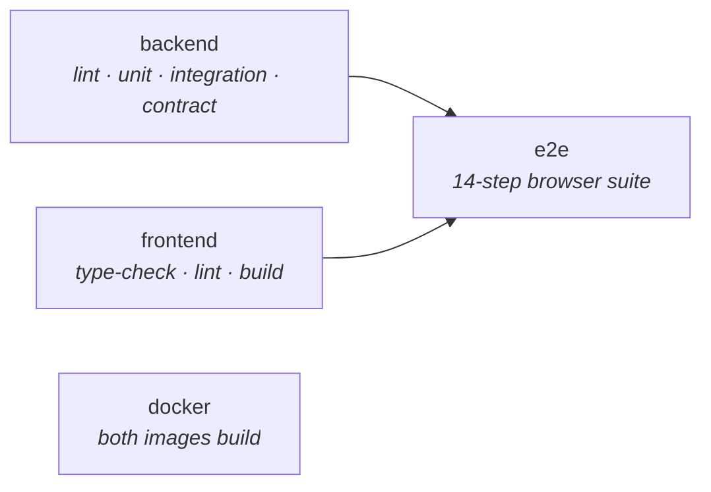

# CI pipeline

Four jobs on every push to `main` and every pull request.

## backend

golangci-lint, then a throwaway PostgreSQL service container initialised with the
real `init.sql` and `seed.sql`, then the whole Go suite.

Followed by a step that exists because of a specific failure mode: it **fails the
build if any integration test skipped**. Skipped tests still report `ok`, so a
wrong database URL would otherwise pass as green with no integration coverage.
See [Testing strategy](testing#one-thing-that-was-silently-broken).

## frontend

Type-check, lint, build — plus a check that `schema.d.ts` is not stale:
regenerate it from the OpenAPI document and fail if the committed copy differs.
That is what keeps the generated types honest.

## e2e

Brings up the real stack — database, API with a writable attachments directory,
and the Vite dev server whose proxy makes the app same-origin — then runs the
browser suite.

Gated on `backend` and `frontend` so a compile error or a stale schema fails as
itself rather than as a confusing browser timeout. Capped at 20 minutes, because
a hung browser wait would otherwise sit on the runner for the six-hour default.
On failure it prints both server logs and uploads the suite's screenshots.

The Chrome binary is resolved by trying the names runner images have used rather
than hardcoding one, so an image change produces a clear error instead of a
failure inside the browser driver.

## docker

Builds both images. Catches Dockerfile breakage that the other jobs never touch.

## documentation

A fifth job builds this site and deploys it to GitHub Pages on pushes to `main`.
Broken internal links **fail the build** — `onBrokenLinks: 'throw'` — because
that is the failure mode documentation sites actually have, and a link checker
that only warns is a link checker nobody reads.

## A note on the workflow itself

An earlier version of this file contained a job that was nothing but a `# TODO`
comment. A job with a null body is invalid, so GitHub rejected the whole workflow
at validation — meaning **no** CI ran at all, including the jobs that were
finished. Worth knowing as a failure mode: a broken workflow file does not fail
loudly per-job, it disables everything.
