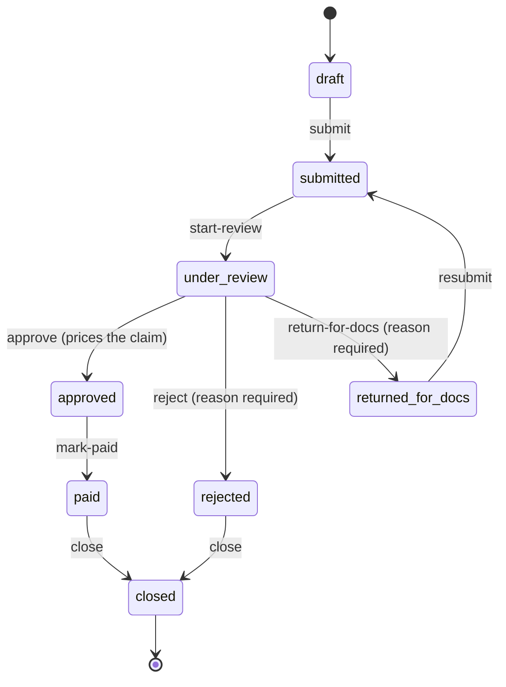

# Claim lifecycle

A claim moves through an explicit state machine. Legal transitions are a table;
anything absent from it is refused with HTTP 409.

## The transitions

| From | Action | To | Who may |
| --- | --- | --- | --- |
| draft | submit | submitted | owner, admin |
| submitted | start-review | under_review | reviewer, admin |
| under_review | approve | approved *(amount computed)* | reviewer, admin |
| under_review | reject *(reason required)* | rejected | reviewer, admin |
| under_review | return-for-docs *(reason required)* | returned_for_docs | reviewer, admin |
| returned_for_docs | resubmit | submitted | owner, admin |
| approved | mark-paid | paid | reviewer, admin |
| paid or rejected | close | closed | reviewer, admin |

Every transition runs through one shared code path which, inside a single
transaction: loads the claim, checks the transition is legal, runs the
action-specific permission check and field updates, saves the claim, and writes
the audit entry. There is no way to add a transition that skips the audit,
because the audit is in the shared part.

## The three real paths

**Approved.** `draft → submitted → under_review → approved → paid → closed`.
Approval is where pricing happens.

**Rejected.** `… → under_review → rejected → closed`. A reason is mandatory and
is stored on the claim, so the employee sees why.

**Returned for documents.** `… → under_review → returned_for_docs → submitted → …`.
The reviewer asks for something missing; the employee attaches it and resubmits.
This is the only loop in the machine, and the one that makes
[claim documents](documents) necessary rather than decorative.

There is also a fourth outcome that is not a path: a **draft** the employee never
submits. It is visible to nobody else and appears in no queue.

## Two details that are easy to miss

**`payment_calculated` exists but is unreachable.** The schema and the enum both
define it, and the reports and annual-cap arithmetic count it as committed spend
— but no transition sets it, because `approve` computes the amount itself. It is
reserved for a possible future separate pricing step.

**Payment is simulated.** `mark-paid` creates a payment row with a generated
`SIM-` reference. There is no bank integration, deliberately — see
[Scope and limits](../about/scope).

## What refusals look like

| Situation | Status | Meaning |
| --- | --- | --- |
| Action not legal from the current status | 409 | e.g. approving a draft |
| Wrong role for the action | 403 | e.g. an employee starting a review |
| Not the claim's owner | 403 | employees may only submit their own |
| Reject or return with no reason | 400 | checked before the transition is attempted |
| Rule engine cannot price it | 422 | carries the specific reason |

See [Errors](../reference/errors) for the full mapping.
