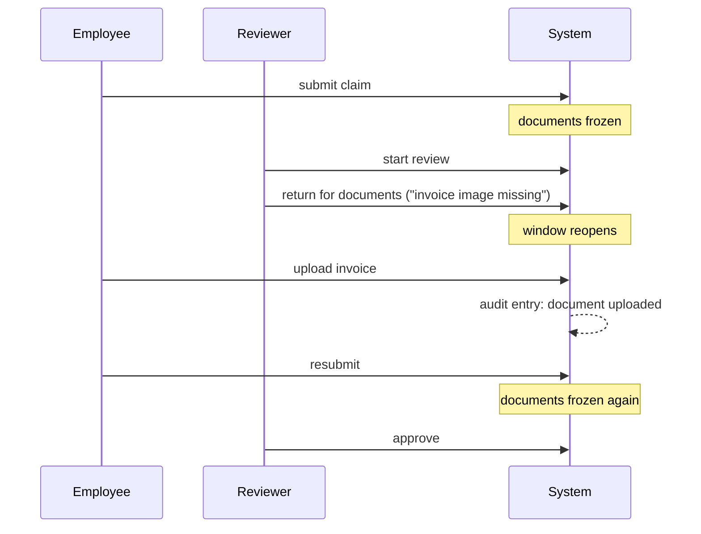

# Claim documents

Employees attach invoices and prescriptions to a claim. The interesting part is
not the upload — it is *when* an upload is allowed.

## The freeze rule

Documents may be added only while a claim is:

- a **draft** — before anyone has seen it, or
- **returned for documents** — a reviewer has explicitly asked for more.

In every other status the API refuses with HTTP 409, and the interface offers no
upload control.

### Why

A reviewer decides on the evidence in front of them. If documents could change
after submission, the basis for a decision could be altered after the decision
was made — and the audit trail would say a claim was approved without being able
to show what it was approved on.

Freezing on submission means the reverse: if something is genuinely missing, the
reviewer returns the claim, which reopens the window deliberately and leaves a
record of having done so.

That is why the rule lives in the claims service and not in the frontend.
Disabling a button is a courtesy; the server refusing is the rule. A direct
`POST` to a frozen claim gets a 409 regardless of what the interface shows.

## The loop in practice

## What is accepted

| | |
| --- | --- |
| Types | PDF, JPEG, PNG, WebP |
| Maximum size | 5 MiB |
| How the type is decided | By **sniffing the file's actual bytes** |

The declared content type and the file extension are both ignored. Renaming a
script to `.pdf` does not get it stored — the sniffed type has to be one of the
four, or the upload is refused as an unsupported type.

## How files are stored

Metadata goes in the database; the bytes go on disk under `ATTACHMENTS_DIR`.

Two properties matter:

**The filename on disk is generated by the server**, as a UUID. The name the
user typed is metadata, shown for display and used for the download filename,
and is never used as a path. A name containing path separators cannot escape the
storage directory, and every read resolves its key against the storage root and
rejects anything absolute or traversing.

**The write order is deliberate.** The file is saved first, then the metadata row
and the audit entry commit together. If that transaction fails, the saved file is
removed. So there is neither a row pointing at a missing file nor an orphaned
file with no row.

## Downloading

Downloads are served with `Content-Disposition: attachment` and
`X-Content-Type-Options: nosniff`, and the filename is RFC 5987-encoded so
Persian filenames survive the round trip. An attachment id belonging to a
different claim returns 404 rather than reading across claims.

Read access follows the claim: the owner, any reviewer or admin, and auditors.
Upload access is narrower — the owner or an admin only. A reviewer can read every
document on a claim and is never offered an upload.

## Audit

Each upload writes an `attachment_upload` entry naming the actor and the file, in
the same transaction as the metadata row. An attachment appearing without a trace
is not a reachable state.
