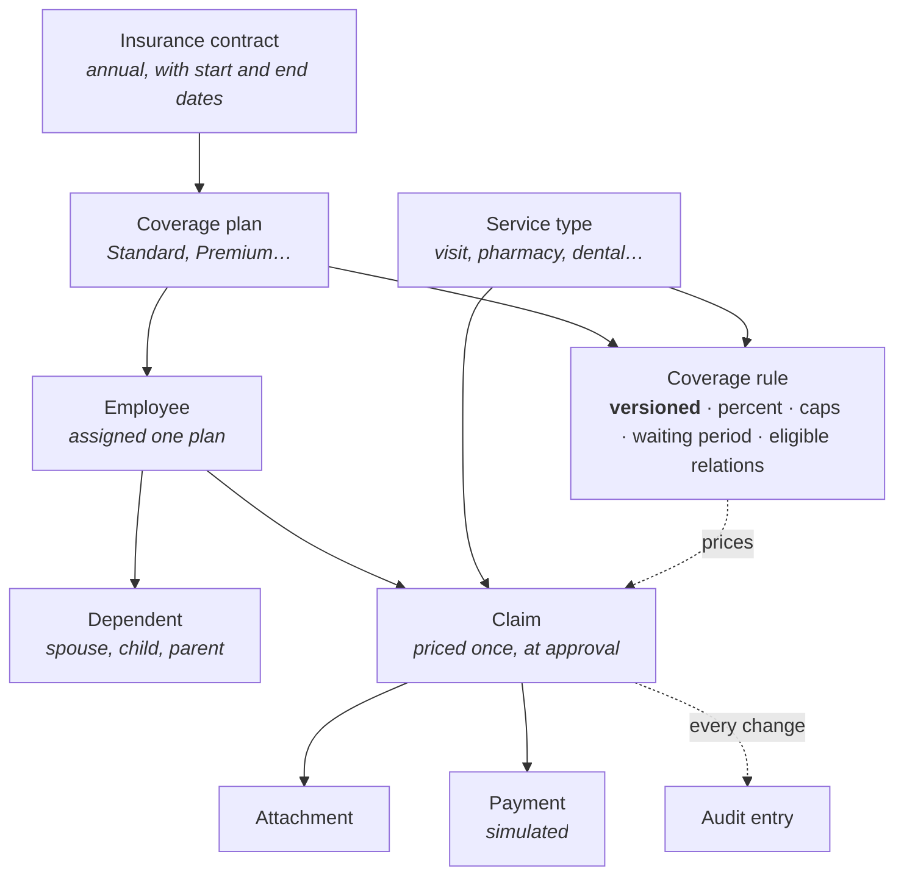

# Domain model

Five concepts carry the system. Everything else supports them.

## The chain that decides an amount

A claim names an employee, a service type and an amount. The employee belongs to
a plan. A rule exists for that (plan, service type) pair, in versions. The
version whose date range contains the claim's **receipt date** is the one that
prices it.

That is the whole mechanism. `employee → plan → rule version → amount`.

## Each concept, briefly

**Insurance contract** — the annual agreement, with a start and end date. The
top of the hierarchy; everything else hangs beneath it.

**Coverage plan** — a tier within a contract. The demo has two: *Standard* for
staff generally, *Premium* for managers and key personnel, with higher ceilings
and shorter waiting periods.

**Service type** — a category that can be claimed for: outpatient visit,
pharmacy, dental, hospitalisation, optometry. New types can be added through the
API and appear in the forms at once, though they need a coverage rule before
anything can be priced against them.

**Coverage rule** — the numbers. One rule per (plan, service type), in versions
with effective dates. This is the only place a percentage or a cap exists.

**Employee** — an insured person: personnel number, national id, hire date,
employment status, and the plan they are on. The hire date matters because
waiting periods count from it. The employment status matters because a
terminated employee's claims are refused.

**Dependent** — a family member, with a relation of `spouse`, `child` or
`parent`. Whether a relation may claim for a given service is decided by the
rule, not by the dependent — a rule that covers only `self, spouse, child`
refuses a claim for a parent.

**Claim** — the transactional heart. Carries the requested amount, the receipt
date, the beneficiary, a status, and — once approved — the applied percentage and
the payable amount.

## What is deliberately absent from the entities

Domain entities carry **no struct tags of any kind**: no JSON, no database
column mapping. The wire format belongs to the transport layer's own types and
the column mapping to the storage layer's, each with an explicit conversion.

The reason is narrow and practical: with tags on a shared struct, renaming a
database column changes the JSON the frontend receives. Keeping three
representations means a persistence detail cannot silently become an API change.

See [Architecture](../engineering/architecture) for how the layers enforce that,
and [Database schema](../reference/database) for the tables themselves.
