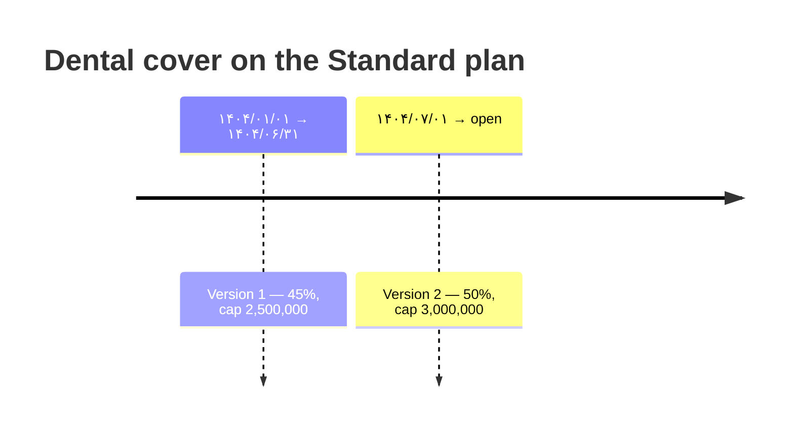

# Rule versioning

Coverage rules are versioned rather than edited. This page is about the
mechanics, and about the one case that makes it non-trivial.

## Publishing

Publishing a new version does two writes in a single transaction:

1. **Close** the currently open version for that (plan, service type) by setting
   its `effective_to`.
2. **Insert** the new version with the requested `effective_from`.

Both commit together with one audit entry recording the previous rule and the new
one. If either write fails, neither happens — there is no window in which a plan
has two open rules or none.



A claim with a receipt date of ۱۴۰۴/۰۵/۱۰ is priced by version 1 at 45%, and
still is today. A claim dated ۱۴۰۴/۰۸/۱۰ is priced by version 2 at 50%.

## "Active" is a date range

Finding the applicable rule is a range query, not a boolean flag:

```sql
effective_from <= receipt_date
AND (effective_to IS NULL OR effective_to >= receipt_date)
```

ordered newest-first. This is what lets a superseded rule still price an old
claim correctly, and it is why there is no `is_active` column to get out of sync.

## The awkward case: republishing on the same day

Closing the outgoing version normally means setting its `effective_to` to
`new.effective_from − 1 day`. If someone publishes a correction on the same day
a rule took effect — or backdates one — that subtraction produces a close date
*before* the row's own start, which violates the schema's
`effective_to >= effective_from` check.

The publish path clamps the close date to the outgoing rule's own start date.
For that one overlapping day two versions match the range query, and the engine
picks the newer one by a `created_at` tiebreak.

The alternative — refusing same-day corrections — would mean a typo in a
published percentage could not be fixed until the next day. For a system whose
whole point is that policy changes are easy, that is the wrong trade.

This behaviour has its own integration test rather than being left to chance.

## Consequences worth knowing

- **Rules are never deleted.** The table is append-mostly; the only field ever
  mutated in place is `effective_to`, and only to close a row.
- **A backdated rule reprices nothing.** Claims already approved carry their
  own stored amount and rule id. Publishing does not walk back over history.
- **Publishing is audited as a configuration change**, with the full before and
  after rule in the entry. See [Audit trail](audit-trail).
