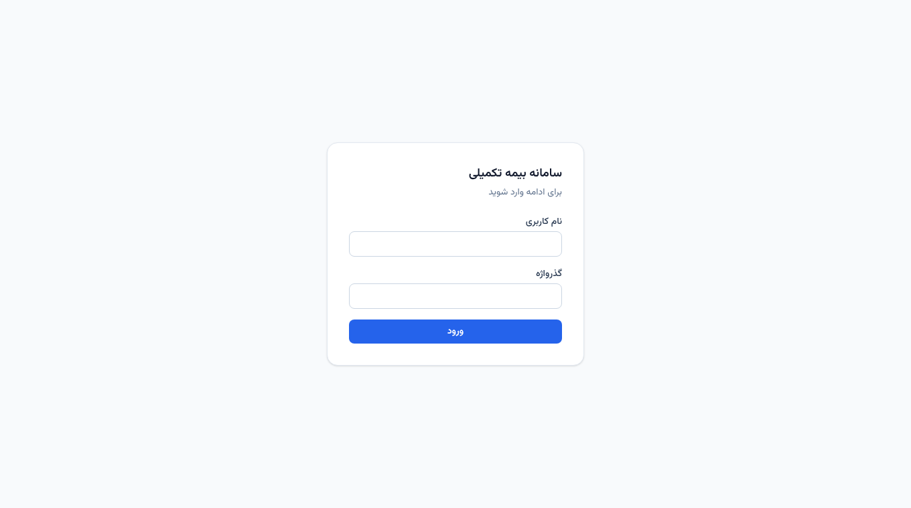
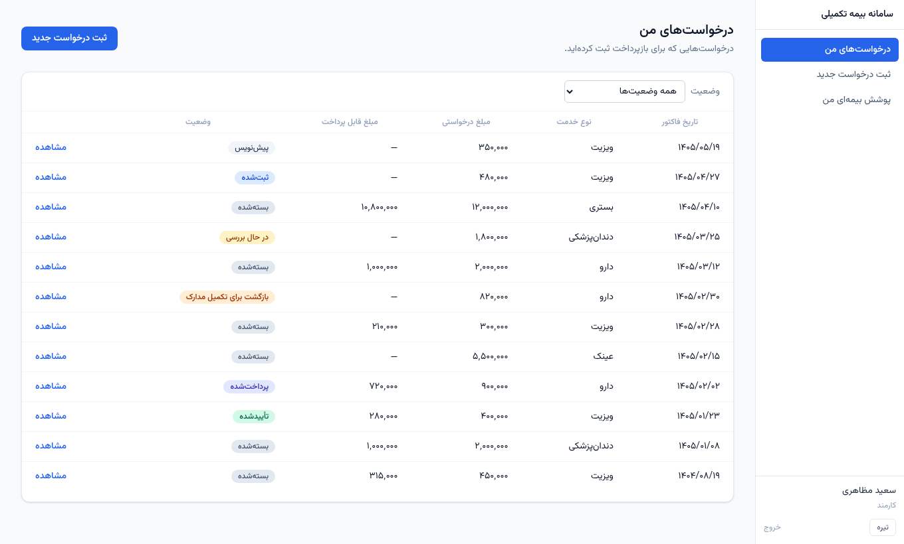
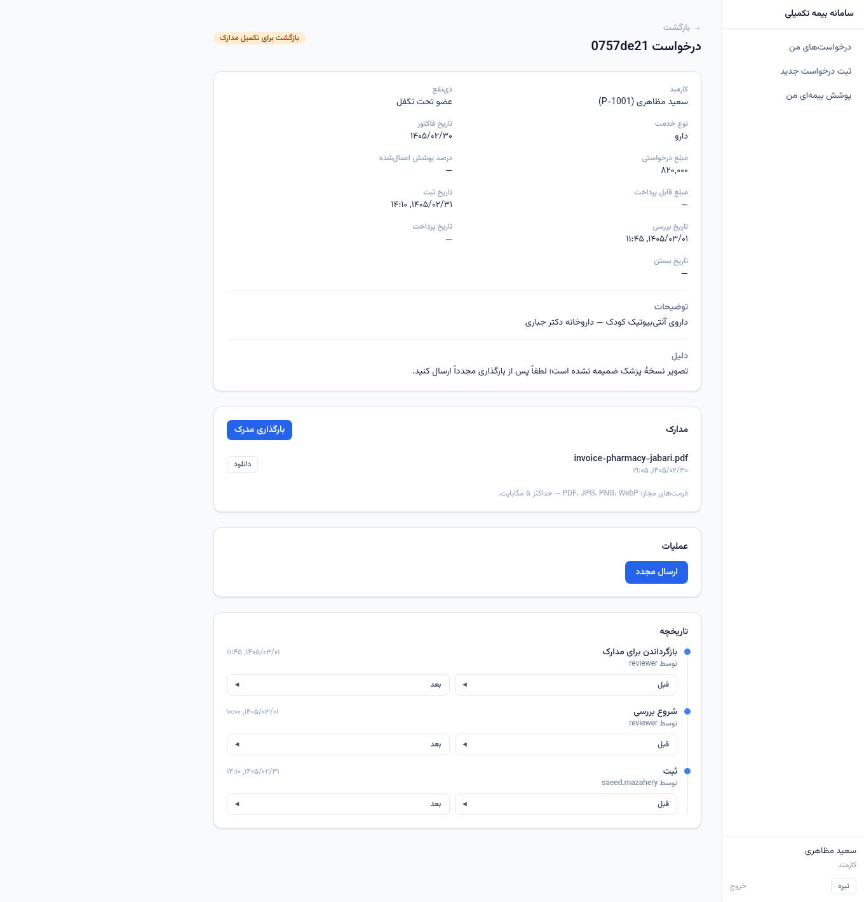
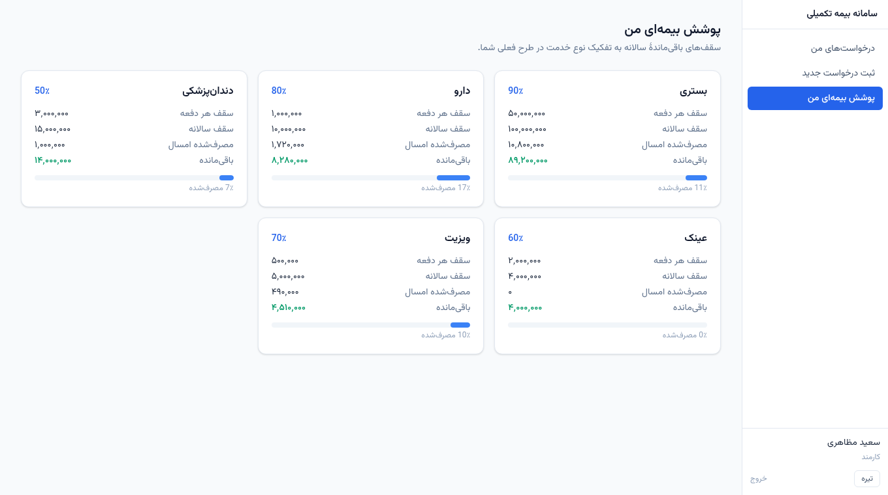
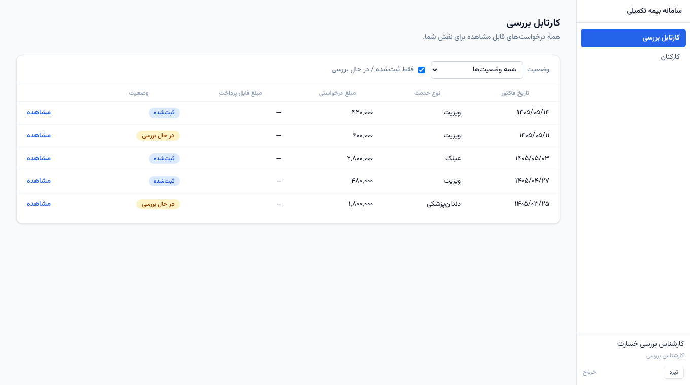
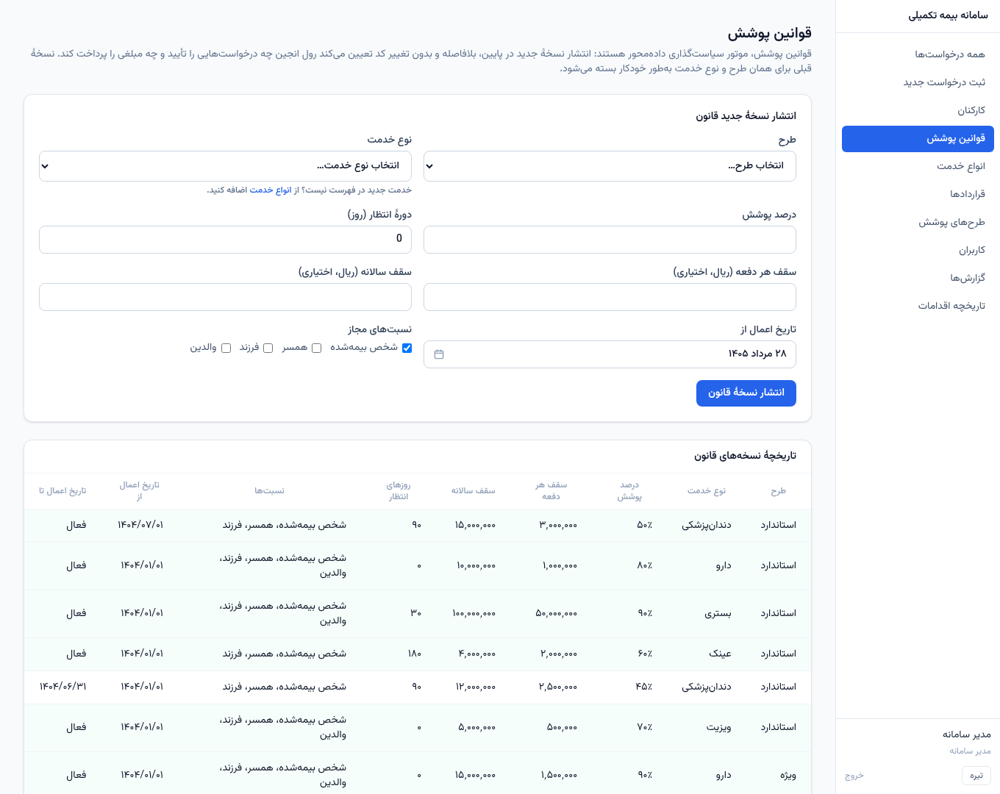
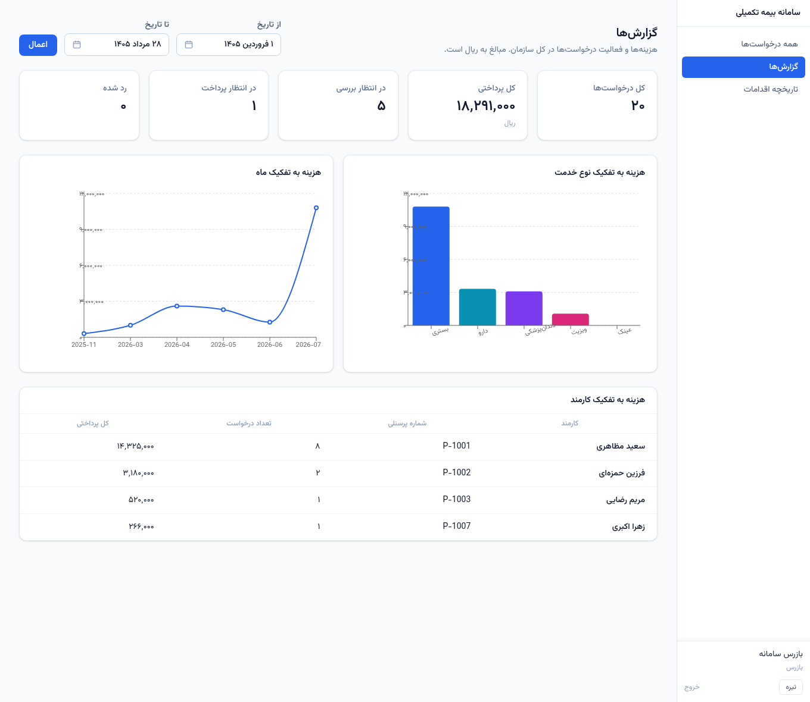
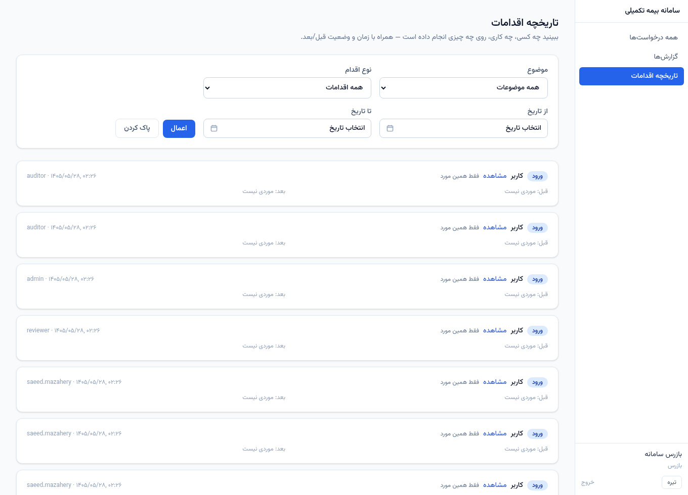

# Screenshot tour

The interface is Persian and right-to-left throughout, with Jalali dates and
Persian digits. Captions here are in English.

## Signing in

Four roles share one login screen. What a user can reach afterwards is decided
by their role at the route and by ownership inside each service — never by
hiding a button.

## An employee's claims

Employees see only claims they created. That restriction lives in the claims
service, so it holds no matter which entry point asks.

## A claim that was returned for documents

The richest screen in the application, and the one worth understanding:

- The reviewer's reason for returning it is shown to the employee.
- The **مدارک** (documents) section lists what is attached, with a download for
  each, and offers an upload control — but only because this claim is in a state
  that accepts one.
- The history at the bottom is the audit trail for this claim, each entry
  expandable to its before and after state.

Submit the claim again and the upload control disappears, because the documents
freeze. See [Claim documents](../how-it-works/documents) for why that matters.

## Remaining allowance

Computed live from the rules that apply to this employee's plan and what they
have already committed this contract year — not stored and not cached.

## The reviewer's queue

A reviewer sees every claim, not just their own, and has the transition actions
an employee does not.

## Publishing a policy change

The screen the whole project is arranged around. See
[The one idea](the-one-idea).

## Reports

Read-only aggregations over committed spend, filterable by date range.

:::note
The monthly chart's axis is labelled with Gregorian months. Monthly grouping is
done in the database with `TO_CHAR(receipt_date, 'YYYY-MM')`, so it does not
follow the Jalali calendar the rest of the interface uses. It is a known
limitation rather than an oversight — see [Scope and limits](../about/scope).
:::

## The audit trail

Filterable by entity, actor, action and date range. The realistic use is
narrow and specific: an employee disputes a decision, you enter their claim's id
and read the whole history back.
